# Pinterest Data Pipeline

## Table of Contents
* [Title](#-Pinterest-Data-Pipeline)
* [project Overview](#Project-Overview)
* [Architecture Diagram](#Architecture-Diagram) 
* [Key Components and Technologies](#Key-Components-and-Technologies)
* [Installation Setup and Deployment](#Installation-Setup-and-Deployment)
* [Integrate with Other Services](#Integrate-with-Other-Services)
* [Key Scripts](#Key-Scripts)
* [Usage](#Usage)
* [License](#License)

## Project Overview

The Pinterest Data Pipeline project is a meticulously crafted system aimed at extracting, storing, transforming, and analyzing emulated Pinterest post data. With an emphasis on robustness and efficiency, this project encompasses the creation of two intricately designed data pipelines: one tailored for batch processing and the other fine-tuned for real-time processing of streaming data. The core objective is to provide a hands-on learning experience while mastering a suite of cutting-edge data engineering tools and services.

## Architecture Diagram
This is an architecture diagram that depict pinterest end to end ETL process.

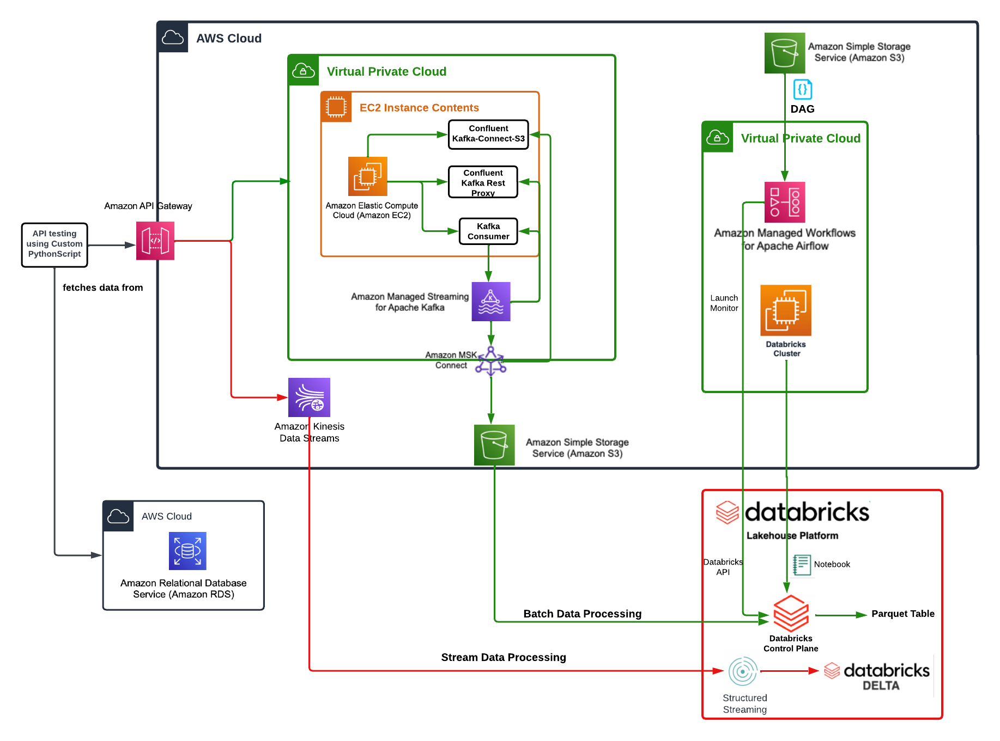

## Key Components and Technologies:
**Programming Language:**

- **Python:** The project harnesses the power of Python for executing Pinterest posting emulation via AWS RDS queries. Additionally, it facilitates seamless interactions with Kafka and AWS Kinesis through meticulously crafted API requests.
- **SQL:** the project will leverage on the power of sql to performe analysis of the data and to run key queries airmed at understaing the data.

### Data Ingestion:

- **Amazon API Gateway:** The deployment of a robust REST API through Amazon API Gateway facilitates seamless communication between Amazon MSK and Kinesis. This ensures frictionless data flow and fosters a cohesive ecosystem conducive to innovation.

- **Kafka (Using Amazon MSK):** Kafka stands at the forefront of data ingestion, gracefully handling the raw Pinterest data influx and proficiently routing it to designated topics within an S3 bucket. This technology ensures that coming from API gateway passes through the designated kafka topic to a destination in S3. This will help to streamlined batch processing using Databricks. To configure kafka using Amazon MSk follow the instruction provided in this official documentation [here](https://docs.aws.amazon.com/msk/latest/developerguide/getting-started.html)

- **Amazon EC2:** The backbone of the Kafka client machine, Amazon EC2 plays a pivotal role in ensuring the seamless operation and integration of Kafka within the data pipeline ecosystem.

### Workflow Orchestration:

- **Apache Airflow (Using Amazon MWAA):** Task scheduling and orchestration are seamlessly managed by Apache Airflow, powered by Amazon MWAA. This dynamic duo ensures the timely execution of batch processing tasks, thereby orchestrating a symphony of data workflows with unparalleled precision.

### Real-time Data Processing:

- **Amazon Kinesis:** Real-time data processing reaches new heights with Amazon Kinesis, serving as the bedrock for ingesting raw Pinterest data as data streams. This enables lightning-fast real-time processing in Databricks, empowering stakeholders with actionable insights in the blink of an eye.

### Data Transformation and Analysis:

- **Databricks:** Databricks is one of the formost tools for data cleaning, transformation, and analysis. It enables both batch and real-time processing modes, Databricks executes multiple programming languages e.g python, and SQL etc providing oppurtunity for profound insights hidden within the large amount of processed data.

## Installation Setup and Deployment
Embarking on the journey to replicate and deploy the Pinterest Data Pipeline project entails a meticulous approach:

**Python Environment Setup:** Lay the groundwork by setting up a Python environment with the necessary dependencies for executing Pinterest posting emulation and facilitating interactions with Kafka and AWS Kinesis.

**VPC:** AWS VPC offers a secure, scalable, and customizable networking environment for deploying and managing your AWS resources. To create and configure VPC follow the documentation [here](https://docs.aws.amazon.com/workspaces/latest/adminguide/amazon-workspaces-vpc.html)

**Amazon EC2:** is a scalable web service by AWS enabling users to deploy and manage virtual servers in the cloud, offering flexibility, reliability, and cost-effectiveness for various computing needs. In this project it is used to set up the Kafka client machine for seamless operation and integration with Kafka. The step by step approach on how to deploy an EC2 can be found [here](https://docs.aws.amazon.com/AWSEC2/latest/UserGuide/get-set-up-for-amazon-ec2.html) or follow these steps to:

[***Launch EC2 Instance***](https://github.com/Ugo4King/pinterest-data-pipeline188/wiki/Amazon-EC2)

[**Connect to EC2 using SSH**](https://github.com/Ugo4King/pinterest-data-pipeline188/wiki/Amazon-EC2)

[**Install Kafka Client on EC2**](https://github.com/Ugo4King/pinterest-data-pipeline188/wiki/Amazon-EC2)

**S3:** is a scalable object storage service by AWS, providing secure, durable, and highly available storage for a wide range of data types and applications. Follow [here](https://docs.aws.amazon.com/AmazonS3/latest/userguide/creating-bucket.html) to configure and create S3 .

**Amazon MSK:** is a fully managed service by AWS for running Apache Kafka, simplifying the setup, scaling, and management of Kafka clusters for streaming data applications. Deployment steps can be found [here](https://docs.aws.amazon.com/msk/latest/developerguide/before-you-begin.html).  

  [Provision Amazon MSK Cluster](https://github.com/Ugo4King/pinterest-data-pipeline188/wiki/pinterest_technology_set_up) 

[Create Kafka Topics](https://github.com/Ugo4King/pinterest-data-pipeline188/wiki/pinterest_technology_set_up)

[Configure Kafka client to use AWS IAM](https://github.com/Ugo4King/pinterest-data-pipeline188/wiki/configure_kafka)

[Connect to Kafka Cluster](https://github.com/Ugo4King/pinterest-data-pipeline188/wiki/configure_kafka)

**Apache Airflow (Using Amazon MWAA):** is an AWS service offering managed Apache Airflow environments, simplifying the orchestration, scheduling, and monitoring of data workflows for analytics and data processing tasks. details of deployment can be found [here](https://docs.aws.amazon.com/mwaa/latest/userguide/create-environment.html)

[**Create MWAA Environment:**](https://github.com/Ugo4King/pinterest-data-pipeline188/wiki/Amazon_airflow)

[**Configure DAGs**](https://github.com/Ugo4King/pinterest-data-pipeline188/wiki/Amazon_airflow)

[**Trigger DAG Runs**](https://github.com/Ugo4King/pinterest-data-pipeline188/wiki/Amazon_airflow)

**Amazon Kinesis:**

Amazon Kinesis is used for real-time data ingestion, and setting it up involves a few simple steps:

[**Create Kinesis Data Stream**](https://github.com/Ugo4King/pinterest-data-pipeline188/wiki/Amazon_airflow)

**Amazon API Gateway:**

Amazon API Gateway simplifies the deployment of REST APIs, enabling seamless communication between different components:

**Create API Gateway API:**

1. Navigate to the Amazon API Gateway console.
2. Click on "Create API" and choose the REST API type.
3. Define your API resources, methods, request/response models, etc.

**Deploy API:**

Once your API is defined, 
1. deploy it to a stage (e.g., "dev", "prod") for testing and production use.
2. Generate an API endpoint URL that can be used to interact with your API.

## Integrate with Other Services

**Configuring Data Flow from API-MSK-S3:**

**API Gateway Integration:**

1. Configure your API Gateway resource to integrate with an AWS service directly using an HTTP integration.
2. Choose the AWS region where your Amazon MSK cluster is deployed.
3. Select "Managed Streaming for Apache Kafka" as the AWS service.
4. Specify the Kafka cluster ARN and the Kafka topic to which you want to publish data.
5. Choose Amazon S3 as the integration type and specify the details of the S3 bucket where data will be saved. !
[dt](./image/api-1.png),  
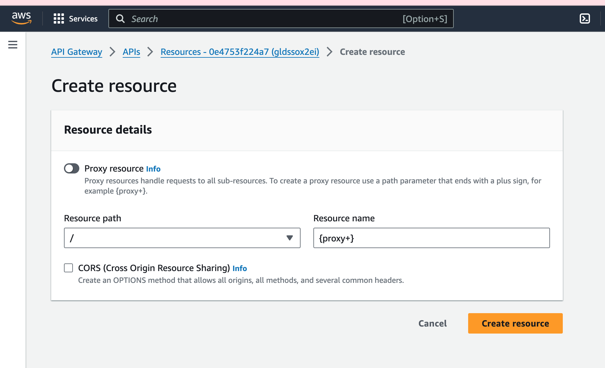, 
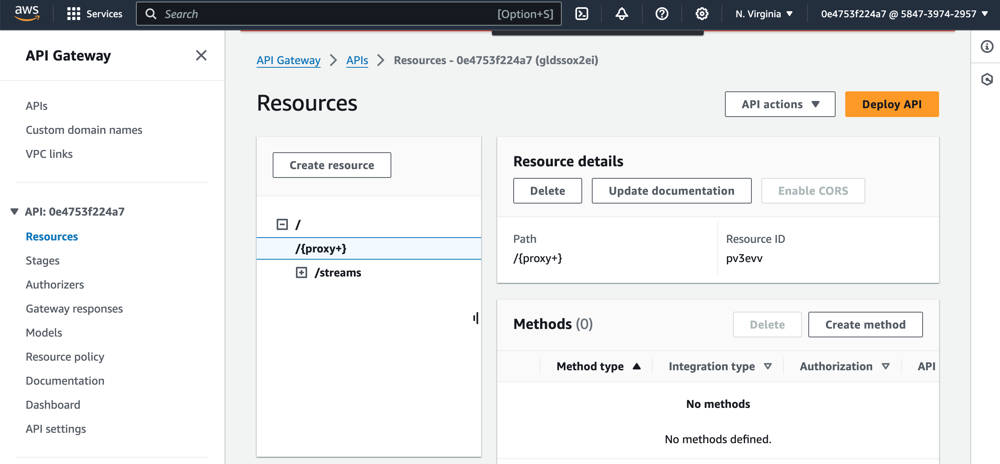,
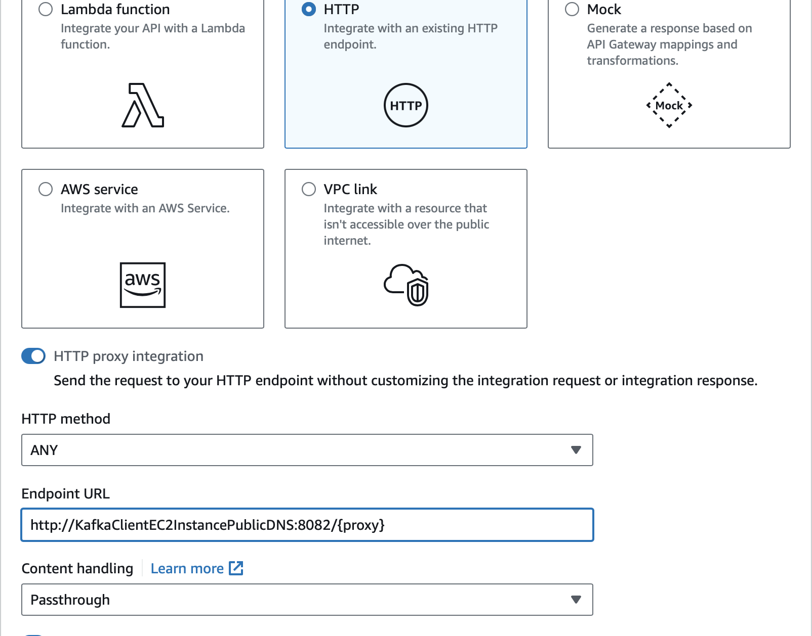,
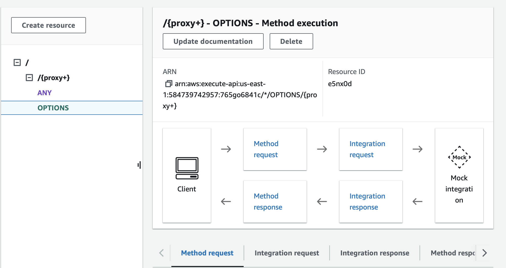,
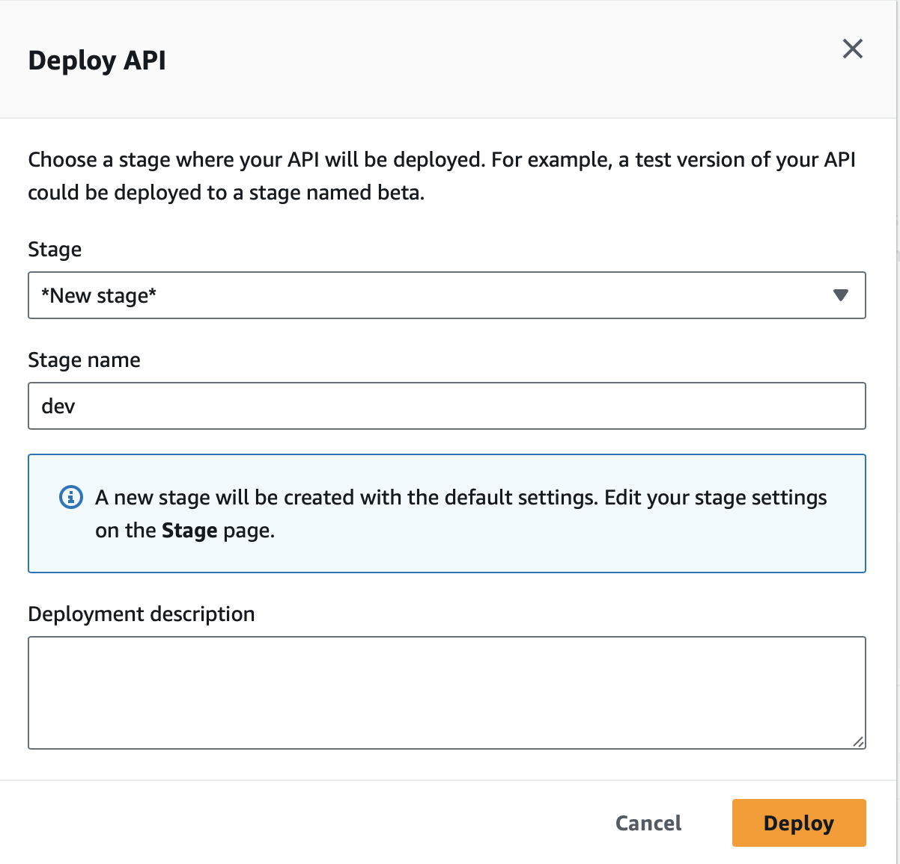,

**S3 Bucket Configuration:**

1. Create an S3 bucket in the AWS Management Console to store the incoming data.
2. Configure the bucket's permissions to allow write access from the API Gateway.

**Create an IAM role that can write to the destination bucket**
Navigate to the IAM console, and select Roles under the Access management section. Choose Create role to create a new IAM role.

Under Trusted entity type, select AWS service, and under the Use case field select S3 in the Use cases for other AWS services field.

create a policy and include the following json 
```sh
{
    "Version": "2012-10-17",
    "Statement": [
        {
            "Sid": "VisualEditor0",
            "Effect": "Allow",
            "Action": [
                "s3:ListBucket",
                "s3:DeleteObject",
                "s3:GetBucketLocation"
            ],
            "Resource": [
                "arn:aws:s3:::<DESTINATION_BUCKET>",
                "arn:aws:s3:::<DESTINATION_BUCKET>/*"
            ]
        },
        {
            "Sid": "VisualEditor1",
            "Effect": "Allow",
            "Action": [
                "s3:PutObject",
                "s3:GetObject",
                "s3:ListBucketMultipartUploads",
                "s3:AbortMultipartUpload",
                "s3:ListMultipartUploadParts"
            ],
            "Resource": "*"
        },
        {
            "Sid": "VisualEditor2",
            "Effect": "Allow",
            "Action": "s3:ListAllMyBuckets",
            "Resource": "*"
        }
    ]
}
```

In the role that is just created, navigate to the Trust relationship and chose Trust entities and add the following trust policy

```sh
{
    "Version": "2012-10-17",
    "Statement": [
        {
            "Effect": "Allow",
            "Principal": {
                "Service": "kafkaconnect.amazonaws.com"
            },
            "Action": "sts:AssumeRole"
        }
    ]
}
```
Create a VPN endpoint to S3 and create a custom plugin by downloading the `Confluent.io Amazon S3 Connector` and then move it to the S3.

```sh
# assume admin user privileges
sudo -u ec2-user -i
# create directory where we will save our connector 
mkdir kafka-connect-s3 && cd kafka-connect-s3
# download connector from Confluent
wget https://d1i4a15mxbxib1.cloudfront.net/api/plugins/confluentinc/kafka-connect-s3/versions/10.0.3/confluentinc-kafka-connect-s3-10.0.3.zip
# copy connector to our S3 bucket
aws s3 cp ./confluentinc-kafka-connect-s3-10.0.3.zip s3://<BUCKET_NAME>/kafka-connect-s3/
```

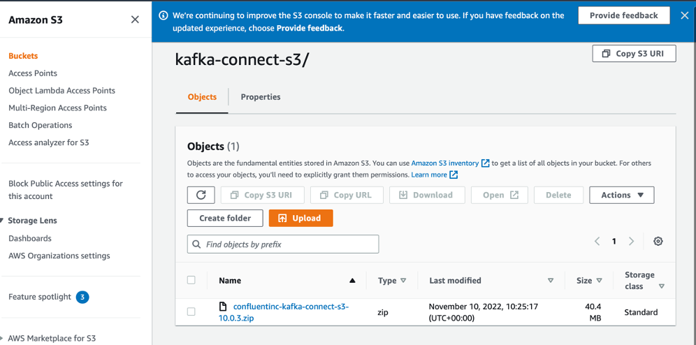 

Open the MSK console and select Custom plugins under the MSK Connect section on the left side of the console. Choose Create custom plugin.

In the list of buckets, find the bucket where you upload the Confluent connector ZIP file. Then, in the list of objects in that bucket select the ZIP file and select the Choose button. Give the plugin a name and press **Create custom plugin**.

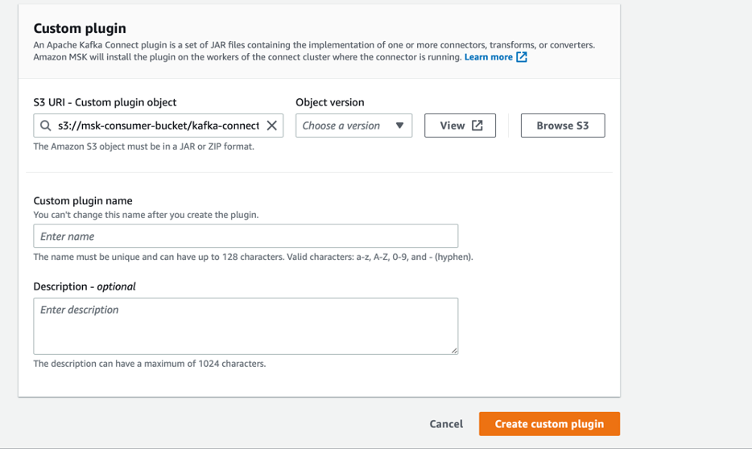

copy the following code into the connector configuration settings 

```sh
connector.class=io.confluent.connect.s3.S3SinkConnector
# same region as our bucket and cluster
s3.region=us-east-1
flush.size=1
schema.compatibility=NONE
tasks.max=3
# include nomeclature of topic name, given here as an example will read all data from topic names starting with msk.topic....
topics.regex=<YOUR_UUID>.*
format.class=io.confluent.connect.s3.format.json.JsonFormat
partitioner.class=io.confluent.connect.storage.partitioner.DefaultPartitioner
value.converter.schemas.enable=false
value.converter=org.apache.kafka.connect.json.JsonConverter
storage.class=io.confluent.connect.s3.storage.S3Storage
key.converter=org.apache.kafka.connect.storage.StringConverter
s3.bucket.name=<BUCKET_NAME>
```

**Deploying API to send data to S3**

1. Deploy your API Gateway to make it publicly accessible.
2. Test the API by sending data to the configured endpoint.
3. Verify that the data is successfully saved to the designated S3 bucket.

**Configuring Data Flow from API to AWS Kinesis:**

**API Gateway Integration:**

1. Create an IAM role for the API access to Kinesis that assums `AmazonKinesisFullAccessRole`.
create a Trust relationship and in Trust entities add the following trust policy: 
2. Configure your API Gateway resource to integrate with Amazon Kinesis using an HTTP integration.
    - Create resource 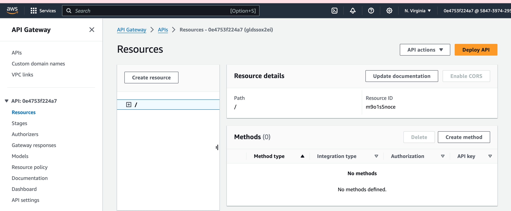
    - Name the resources streams 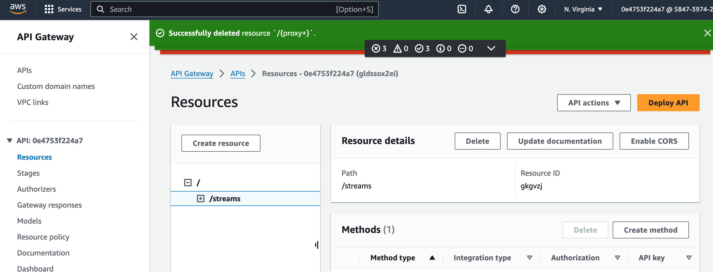
    - edit the integration type to include: 
    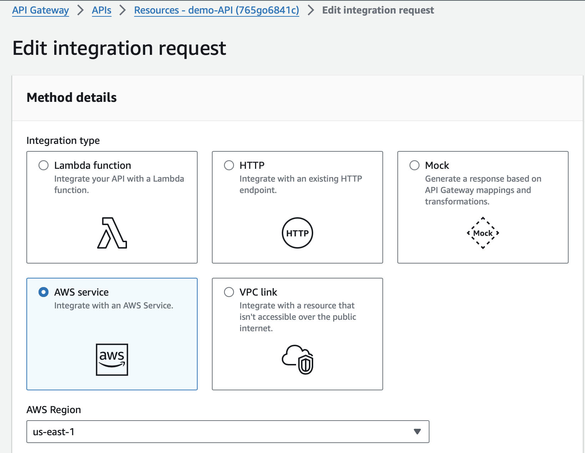,
    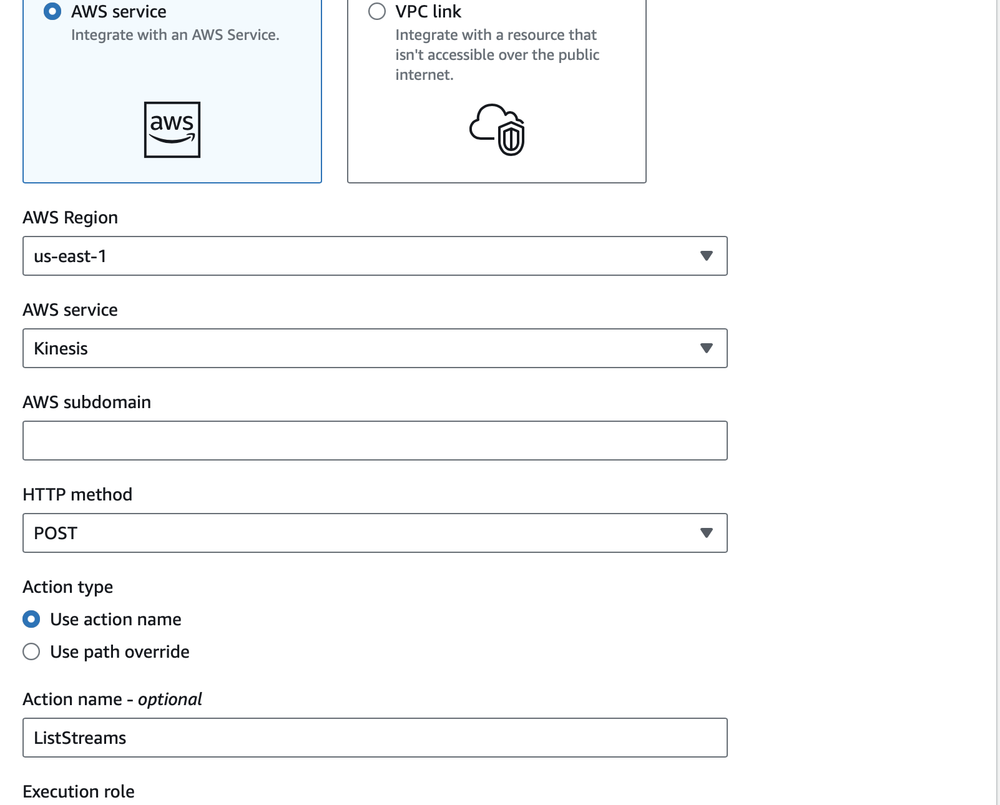,
    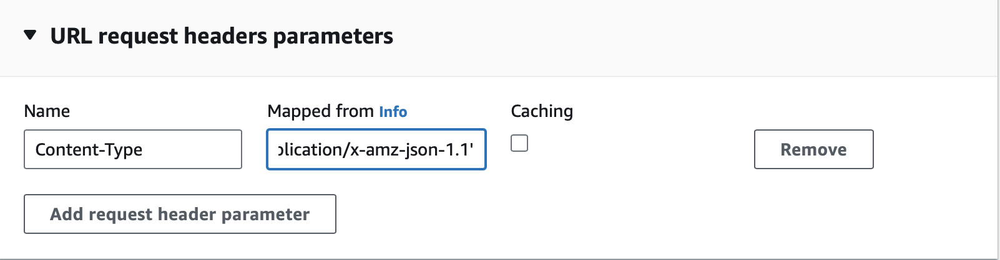,
    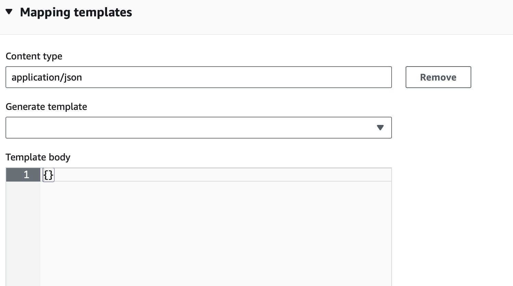,
    - Create a child resources under the streams with resource name `{stream-name}`. 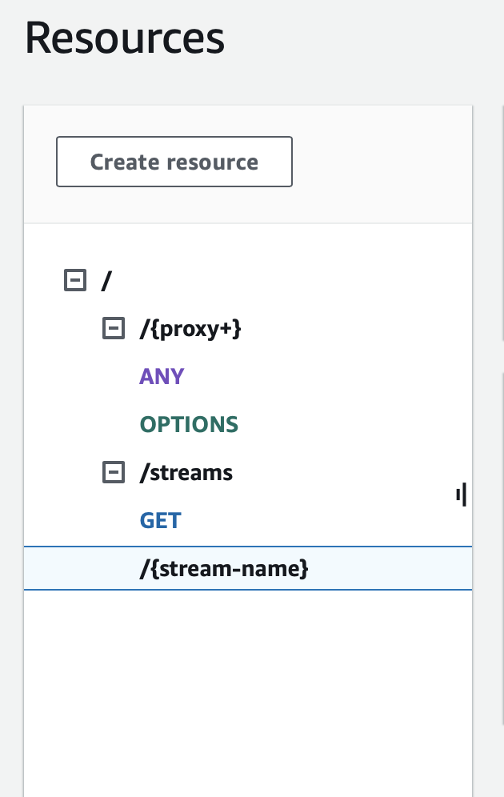,
    - under the child resources create the following resources: 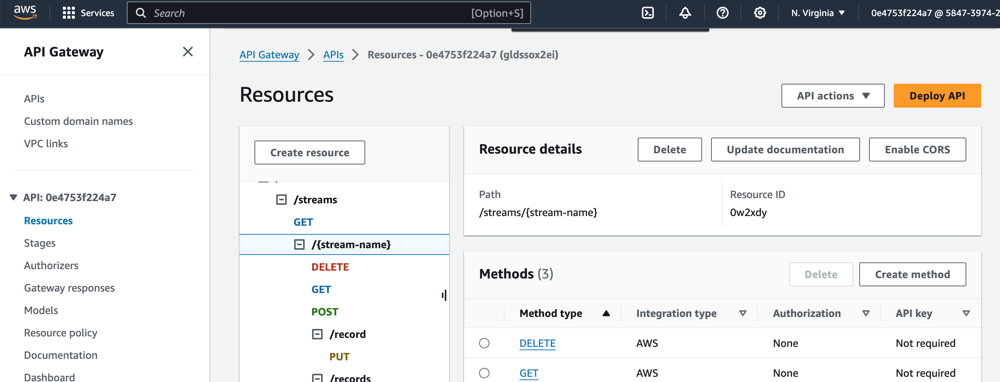

3. Specify the details of the AWS Kinesis data stream where data will be sent.

**AWS Kinesis Data Stream:**

Configure the stream's permissions to allow write access from the API Gateway by ensuring that the following is included in the IAM policy.

```sh
{
    "Version": "2012-10-17",
    "Statement": [
        {
            "Effect": "Allow",
            "Action": [
                "kinesis:PutRecord",
                "kinesis:PutRecords"
            ],
            "Resource": "arn:aws:kinesis:region:account-id:stream/stream-name"
        }
    ]
}
```

**API Gateway Deployment to send data to kinesis:**

1. Deploy your API Gateway to make it publicly accessible.
2. Test the API by sending data to the configured endpoint.
3. Verify that the data is successfully sent to the AWS Kinesis data stream.

**Databricks:**

Databricks is utilized for data cleaning, transformation, and analysis tasks in both batch and real-time processing modes:

**Provision Databricks Workspace:**

1. Navigate to the Azure Databricks portal.
2. Create a new workspace and configure the workspace settings, including the Azure region, pricing tier, etc.
3. Invite collaborators and set up access controls as needed. 
>(**NB:** we are using an already created workspace)

**Create Clusters:**

1. Create one or more Databricks clusters with the desired configurations (e.g., instance type, auto-scaling settings, etc.).
2. Configure cluster access controls and permissions.
>(**NB:** we are using an already created cluster)

**Develop and Execute Jobs:**

Develop notebooks for data cleaning, transformation, and analysis tasks using languages like Python and SQL.
Create jobs to schedule and execute these notebooks as batch processing tasks or set up streaming jobs for real-time processing.

## Key Scripts
[user_posting_emulation.py](user_posting_emulation.py) this Python scripts emulate Pinterest post data by extracting data from AWS RDBS and making a post request to API which has been configured to send the data to designated S3 bucket through Amazon MSK.

[user_posting_emulation_streams.py](user_posting_emulation_streams.py) this is a python scripts that emulate pinterest post data by extracting data from AWS RDBS and making a post request to an API which has been configured to pass the post data to Amazon kinesis in a streaming format.

[batch_data_processing_in_databricks.ipynb](batch_data_processing_in_databricks.ipynb) this is a databricks notebook that mounts Amazon S3 boucket in DBFS and use pyspark to perform data cleaning on batch data in S3 bucket and write the cleaned data to Parquet table.

`stream_data_processing_in_databricks.ipynb` thia is a databricks notebook which connects to Amazon Kinesis, read the streaming data, perform some tranformation using pyspark and write the data to Delta table.

`data_analysis.ipynb` this is a databricks notebook that use spark SQL to perform specific queries that provided insight on the tranformed data. 

## Usage
Clone the reposetory
```sh
git clone https://github.com/Ugo4King/pinterest-data-pipeline188.git
```
change to pinterest-data-pipeline188 directory
```sh
cd pinterest-data-pipeline188
```
Run the python script 
```sh
python user_posting_emulation.py
``` 
on your localhost to mimik the pinterest data and post the data to API gateway which will be stored in S3 as batch.

Run the python script for stream data
```sh
python user_posting_emulation_stream.py
``` 
on your localhost to post the pinterest data to API through to Amazon Kinesis.

**Airflow**
Trigger the Aiflow DAGs run the databricks notebook [batch_data_processing_in_databricks.ipynb](batch_data_processing_in_databricks.ipynb) for batch data processing
the Aiflow DAGs will also run the stream databricks notebook [stream_dataprocessing_in_databricks.ipynb](stream_dataprocessing_in_databricks.ipynb) for stream data processing and finally the data analysis task will run the [data_analysis.ipynb](data_analysis.ipynb) to perfom the neccessary analysis for insight on the transformed data.

**Databricks**
Schedule databricks job to run the batch notebook [batch_data_processing_in_databricks.ipynb](batch_data_processing_in_databricks.ipynb) at the desired interval. similarly, use databricks job to trigger the stream notebook [stream_dataprocessing_in_databricks.ipynb](stream_dataprocessing_in_databricks.ipynb) for stream data processing and then use the data analysis notebook to perform the neccessary SQL query to provide insight on the cleaned data.


## License:
This project is licensed under [License](LICENSE.md). 