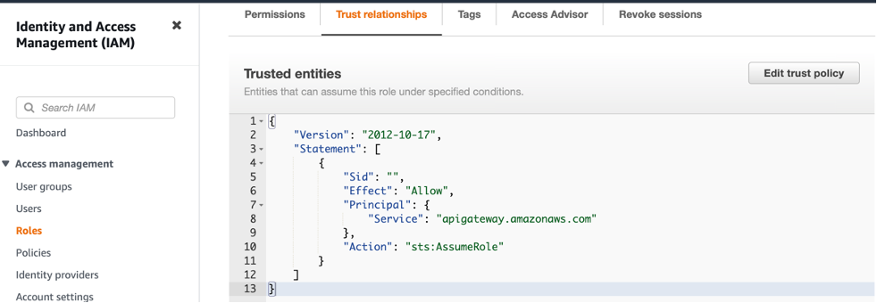

**Pinterest Data Pipeline**

**Project Overview:**

The Pinterest Data Pipeline project is a meticulously crafted system aimed at extracting, storing, transforming, and analyzing emulated Pinterest post data. With an emphasis on robustness and efficiency, this project encompasses the creation of two intricately designed data pipelines: one tailored for batch processing and the other fine-tuned for real-time processing of streaming data. The core objective is to provide a hands-on learning experience while mastering a suite of cutting-edge data engineering tools and services.

**Key Components and Technologies:**
**Programming Language:**

**Python:** The project harnesses the power of Python for executing Pinterest posting emulation via AWS RDS queries. Additionally, it facilitates seamless interactions with Kafka and AWS Kinesis through meticulously crafted API requests.

**Data Ingestion:**

**Kafka (Using Amazon MSK):** Kafka stands at the forefront of data ingestion, gracefully handling the raw Pinterest data influx and proficiently routing it to designated topics within an S3 bucket. This setup ensures streamlined batch processing in Databricks.

**Step-by-Step Setup:**

1.  Provision Amazon MSK cluster through the AWS Management Console.
2.  Configure your MSK cluster settings, including the number of brokers, instance types, security settings, etc.
3.  Create topics within your MSK cluster to organize incoming data.
4.  Update Kafka configurations in your application code to connect to the provisioned MSK cluster.

**Infrastructure:**

**Amazon EC2:** The backbone of the Kafka client machine, Amazon EC2 plays a pivotal role in ensuring the seamless operation and integration of Kafka within the data pipeline ecosystem.

**Workflow Orchestration:**

**Apache Airflow (Using Amazon MWAA):** Task scheduling and orchestration are seamlessly managed by Apache Airflow, powered by Amazon MWAA. This dynamic duo ensures the timely execution of batch processing tasks, thereby orchestrating a symphony of data workflows with unparalleled precision.

**Real-time Data Processing:**

**Amazon Kinesis:** Real-time data processing reaches new heights with Amazon Kinesis, serving as the bedrock for ingesting raw Pinterest data as data streams. This enables lightning-fast real-time processing in Databricks, empowering stakeholders with actionable insights in the blink of an eye.

**API Gateway:**
**Amazon API Gateway:** The deployment of a robust REST API through Amazon API Gateway facilitates seamless communication between Amazon MSK and Kinesis. This ensures frictionless data flow and fosters a cohesive ecosystem conducive to innovation.

**Data Transformation and Analysis:**

**Databricks:** Databricks emerges as the undisputed champion for data cleaning, transformation, and analysis. With its prowess in both batch and real-time processing modes, Databricks executes SQL queries with finesse, unraveling key metrics and unveiling profound insights hidden within the vast expanse of processed data.

**Project Structure:**

1. **Data Extraction:**
Emulates Pinterest post data using meticulously crafted Python scripts, leveraging the power of AWS RDS queries to extract mission-critical information.

2. **Data Ingestion:**

**Batch Processing:** Harnesses the robust capabilities of Kafka (Amazon MSK) to ingest raw Pinterest data and seamlessly route it to designated topics within an S3 bucket, setting the stage for streamlined batch processing in Databricks.

**Real-time Processing:** Leverages the unparalleled efficiency of Amazon Kinesis for ingesting raw Pinterest data as data streams, fueling lightning-fast real-time processing in Databricks.

3. **Data Transformation:**

**Batch Processing:** Executes intricate data cleaning and transformation tasks in Databricks, laying the foundation for meticulous batch processing of extracted data.

**Real-time Processing:** Embarks on a journey of real-time data cleaning and transformation within Databricks, ensuring seamless processing of streaming data with unparalleled efficiency.

4. **Analysis and Insights:**
Unveils the power of SQL queries in Databricks, unraveling key metrics and unveiling profound insights from the processed data. This facilitates data-driven decision-making and empowers stakeholders with actionable insights.

5. **Task Scheduling and Orchestration:**
Seamlessly orchestrated by Apache Airflow (Amazon MWAA), batch processing tasks unfold with unparalleled precision, ensuring the timely execution of data workflows and fostering an environment of operational excellence.

**Setup and Deployment:**
Embarking on the journey to replicate and deploy the Pinterest Data Pipeline project entails a meticulous approach:

**Python Environment Setup:** Lay the groundwork by setting up a Python environment with the necessary dependencies for executing Pinterest posting emulation and facilitating interactions with Kafka and AWS Kinesis.

**Kafka (Using Amazon MSK):**
Kafka serves as a powerful data ingestion tool, and setting it up with Amazon Managed Streaming for Apache Kafka (Amazon MSK) is straightforward:

**Provision Amazon MSK Cluster:**

1. Navigate to the AWS Management Console and search for "MSK".
2. Click on "Create cluster" and follow the setup wizard.
3. Choose a suitable deployment mode (Single-broker, Multi-broker, or Dedicated Zookeeper).
4. Configure your cluster settings, including the number of brokers, instance types, security settings, etc.
5. Review and confirm your settings, then create the cluster.

**Create Kafka Topics:**

Once the cluster is provisioned, 
1. Navigate to the Amazon MSK console.
2. Select your cluster and navigate to the "Kafka settings" tab.
3. Click on "Create topic" and specify the topic name, number of partitions, replication factor, etc.
4. Create topics as needed to organize incoming data.

**Update Kafka Configurations:**

Update Kafka configurations in your application code to connect to the provisioned MSK cluster.
Configure producers to write data to the specified topics and consumers to read data from these topics.

**Amazon EC2:**

Amazon EC2 is used to set up the Kafka client machine for seamless operation and integration with Kafka:

***Launch EC2 Instance:***

1. Navigate to the AWS Management Console and search for "EC2".
2. Click on "Launch Instance" and choose an Amazon Machine Image (AMI) suitable for your requirements.
3. Select an instance type, configure instance details, add storage, configure security groups, etc.
4. Review and launch the instance.
(**NB:** for the purpose of this project we are using already provisioned EC2 so we only SSH into it)

**Connecting to Ec2 using SSH**
1. create a `.pam` file in your local directory that will contain the key pair for the instance you are lunching.
2. Set the neccessary permission by running the following code on your localhost terminal `chmod 400 /path/to/private_key.pem.`
3. navigate to the directory with the `.pam` file and run the SSH code `ssh -i "private_key.pem" ec2-user@public_dns_name.` or run it in any directory by providing the right path to th`.pam` file `ssh -i /path/to/private_key.pem ec2-user@public_dns_name.`

**Install Kafka Client:**

1. SSH into the EC2 instance using your preferred SSH client.
2. Install Kafka client dependencies using package managers like apt or yum. (i.e install java-1.8.0 using `sudo yum install java-1.8.0`)
3. Download Apache Kafka using the following `wget https://archive.apache.org/dist/kafka/2.8.1/kafka_2.12-2.8.1.tgz` and extract the zipped file using `tar -xzf kafka_2.12-2.8.1.tgz`.
4. Configure your Kafka client to use AWS IAM authentication to the cluster, by adjusting server.properties file. firstly navigate to the kafka intalled directory and cd into the lib folder and download the **IAM MSK authentication package** by running the following command `
wget https://github.com/aws/aws-msk-iam-auth/releases/download/v1.1.5/aws-msk-iam-auth-1.1.5-all.jar`. 
5. set up the class path environment by running the following command `export CLASSPATH=/home/ec2-user/kafka_2.12-2.8.1/libs/aws-msk-iam-auth-1.1.5-all.jar`


**Configure Kafka client to use AWS IAM**
1. Navigate to kafka installation folder and cd into bin and run the following command `nano clinent.properties`
2. Ensure that it contains
```# Sets up TLS for encryption and SASL for authN.
security.protocol = SASL_SSL

# Identifies the SASL mechanism to use.
sasl.mechanism = AWS_MSK_IAM

# Binds SASL client implementation.
sasl.jaas.config = software.amazon.msk.auth.iam.IAMLoginModule required awsRoleArn="Your Access Role";

# Encapsulates constructing a SigV4 signature based on extracted credentials.
# The SASL client bound by "sasl.jaas.config" invokes this class.
sasl.client.callback.handler.class = software.amazon.msk.auth.iam.IAMClientCallbackHandler

# Additional line of configuration
# Specify the AWS region for the MSK cluster
bootstrap.servers = your-broker-hostname.amazonaws.com:9094
sasl.region = us-east-1
```
**Connect to Kafka Cluster:**

1. Connect to the Kafka cluster using the bootstrap servers provided in the Amazon MSK console. 
2. Create a kafka topic by running the following command `./kafka-topics.sh --bootstrap-server BootstrapServerString --command-config client.properties --create --topic <topic_name>`. eunsuer you are in kafka/bin directory before running the code. also change the bootstrap-server and kafka topic.
3. Create and Runn a producer by running the following command `./kafka-console-producer.sh --bootstrap-server BootstrapServerString --producer.config client.properties --group students --topic <topic_name>`
4. Create and run consumer by running the following command `./kafka-console-consumer.sh --bootstrap-server BootstrapServerString --consumer.config client.properties --group students --topic <topic_name> --from-beginning`


**Apache Airflow (Using Amazon MWAA):**
Apache Airflow setup with Amazon Managed Workflows for Apache Airflow (MWAA) simplifies task scheduling and orchestration:

**Create MWAA Environment:**

1. Navigate to the Amazon MWAA console.
2. Click on "Create environment" and follow the setup wizard.
3. Choose a name for your environment, select a VPC and subnet, configure networking settings, etc.
4. Review and create the environment.

**Configure DAGs:**

1. Upload your DAG (Directed Acyclic Graph) Python scripts to the MWAA environment.
2. Define tasks and dependencies within your DAG scripts.
3. Use MWAA environment variables to pass configuration settings to your DAGs.

**Trigger DAG Runs:**

Once your DAGs are configured, trigger DAG runs manually or set up schedule intervals for automatic execution.
Monitor DAG runs and view logs through the MWAA console.

**Amazon Kinesis:**

Amazon Kinesis is used for real-time data ingestion, and setting it up involves a few simple steps:

**Create Kinesis Data Stream:**

1. Navigate to the Amazon Kinesis console.
2. Click on "Create data stream" and specify the stream name, number of shards, etc.
3. Create the data stream to start ingesting data.

**Amazon API Gateway:**

Amazon API Gateway simplifies the deployment of REST APIs, enabling seamless communication between different components:

**Create API Gateway API:**

1. Navigate to the Amazon API Gateway console.
2. Click on "Create API" and choose the REST API type.
3. Define your API resources, methods, request/response models, etc.

**Deploy API:**

Once your API is defined, 
1. deploy it to a stage (e.g., "dev", "prod") for testing and production use.
2. Generate an API endpoint URL that can be used to interact with your API.

**Integrate with Other Services:**

****Configuring Data Flow from API to S3:**

**API Gateway Integration:**

1. Configure your API Gateway resource to integrate with an AWS service directly using an HTTP integration.
2. Choose the AWS region where your Amazon MSK cluster is deployed.
3. Select "Managed Streaming for Apache Kafka" as the AWS service.
4. Specify the Kafka cluster ARN and the Kafka topic to which you want to publish data.
5. Choose Amazon S3 as the integration type and specify the details of the S3 bucket where data will be saved.

**S3 Bucket Configuration:**

1. Create an S3 bucket in the AWS Management Console to store the incoming data.
2. Configure the bucket's permissions to allow write access from the API Gateway.

**Create an IAM role that can write to the destination bucket**
Navigate to the IAM console, and select Roles under the Access management section. Choose Create role to create a new IAM role.

Under Trusted entity type, select AWS service, and under the Use case field select S3 in the Use cases for other AWS services field.

create a policy and include the following json ```{
    "Version": "2012-10-17",
    "Statement": [
        {
            "Sid": "VisualEditor0",
            "Effect": "Allow",
            "Action": [
                "s3:ListBucket",
                "s3:DeleteObject",
                "s3:GetBucketLocation"
            ],
            "Resource": [
                "arn:aws:s3:::<DESTINATION_BUCKET>",
                "arn:aws:s3:::<DESTINATION_BUCKET>/*"
            ]
        },
        {
            "Sid": "VisualEditor1",
            "Effect": "Allow",
            "Action": [
                "s3:PutObject",
                "s3:GetObject",
                "s3:ListBucketMultipartUploads",
                "s3:AbortMultipartUpload",
                "s3:ListMultipartUploadParts"
            ],
            "Resource": "*"
        },
        {
            "Sid": "VisualEditor2",
            "Effect": "Allow",
            "Action": "s3:ListAllMyBuckets",
            "Resource": "*"
        }
    ]
}```

In the role that is just created, navigate to the Trust relationship and chose Trust entities and add the following trust policy ```{
    "Version": "2012-10-17",
    "Statement": [
        {
            "Effect": "Allow",
            "Principal": {
                "Service": "kafkaconnect.amazonaws.com"
            },
            "Action": "sts:AssumeRole"
        }
    ]
}```
Create a VPN endpoint to S3 and create a custom plugin by downloading the `Confluent.io Amazon S3 Connector` and then move it to the S3.

```# assume admin user privileges
sudo -u ec2-user -i
# create directory where we will save our connector 
mkdir kafka-connect-s3 && cd kafka-connect-s3
# download connector from Confluent
wget https://d1i4a15mxbxib1.cloudfront.net/api/plugins/confluentinc/kafka-connect-s3/versions/10.0.3/confluentinc-kafka-connect-s3-10.0.3.zip
# copy connector to our S3 bucket
aws s3 cp ./confluentinc-kafka-connect-s3-10.0.3.zip s3://<BUCKET_NAME>/kafka-connect-s3/
```

[dt](./dt_screen/Plugin ZIP.png) 

Open the MSK console and select Custom plugins under the MSK Connect section on the left side of the console. Choose Create custom plugin.

In the list of buckets, find the bucket where you upload the Confluent connector ZIP file. Then, in the list of objects in that bucket select the ZIP file and select the Choose button. Give the plugin a name and press **Create custom plugin**.

[dt](./dt_screen/Custom plugin.png)

copy the following code into the connector configuration settings 

```connector.class=io.confluent.connect.s3.S3SinkConnector
# same region as our bucket and cluster
s3.region=us-east-1
flush.size=1
schema.compatibility=NONE
tasks.max=3
# include nomeclature of topic name, given here as an example will read all data from topic names starting with msk.topic....
topics.regex=<YOUR_UUID>.*
format.class=io.confluent.connect.s3.format.json.JsonFormat
partitioner.class=io.confluent.connect.storage.partitioner.DefaultPartitioner
value.converter.schemas.enable=false
value.converter=org.apache.kafka.connect.json.JsonConverter
storage.class=io.confluent.connect.s3.storage.S3Storage
key.converter=org.apache.kafka.connect.storage.StringConverter
s3.bucket.name=<BUCKET_NAME>
```

**API Gateway Deployment:**

1. Deploy your API Gateway to make it publicly accessible.
2. Test the API by sending data to the configured endpoint.
3. Verify that the data is successfully saved to the designated S3 bucket.

**Configuring Data Flow from API to AWS Kinesis:**

**API Gateway Integration:**

1. Create an IAM role for the API access to Kinesis that assums `AmazonKinesisFullAccessRole`.
create a Trust relationship and in Trust entities add the following trust policy: 
2. Configure your API Gateway resource to integrate with Amazon Kinesis using an HTTP integration.

3. Specify the details of the AWS Kinesis data stream where data will be sent.

**AWS Kinesis Data Stream:**

Configure the stream's permissions to allow write access from the API Gateway.

**API Gateway Deployment:**

1. Deploy your API Gateway to make it publicly accessible.
2. Test the API by sending data to the configured endpoint.
3. Verify that the data is successfully sent to the AWS Kinesis data stream.

**Databricks:**

Databricks is utilized for data cleaning, transformation, and analysis tasks in both batch and real-time processing modes:

**Provision Databricks Workspace:**

1. Navigate to the Azure Databricks portal.
2. Create a new workspace and configure the workspace settings, including the Azure region, pricing tier, etc.
3. Invite collaborators and set up access controls as needed.

**Create Clusters:**

1. Create one or more Databricks clusters with the desired configurations (e.g., instance type, auto-scaling settings, etc.).
2. Configure cluster access controls and permissions.
(**NB:** we are using an already created cluster)

**Develop and Execute Jobs:**

Develop notebooks for data cleaning, transformation, and analysis tasks using languages like Python.
Create jobs to schedule and execute these notebooks as batch processing tasks or set up streaming jobs for real-time processing.

Usage:
Once deployed, the Pinterest Data Pipeline project stands ready to revolutionize data processing and analysis:

**Data Emulation and Extraction:** Emulate Pinterest post data and extract mission-critical information using meticulously crafted Python scripts.

**Data Ingestion and Processing:** Ingest the extracted data into the system using either Kafka (for batch processing) or Amazon Kinesis (for real-time processing), fueling seamless processing and analysis.

**Data Transformation and Analysis:** Embark on a journey of data transformation and analysis within Databricks, executing intricate SQL queries to unravel key metrics and unveil profound insights from the processed data, empowering stakeholders with actionable insights and facilitating data-driven decision-making.

**Contributors:**


**License:**
This project is licensed under [License]. For more details, please refer to the LICENSE.md file included in the project repository.

Acknowledgments:
The Pinterest Data Pipeline project owes its success and innovation to the invaluable contributions and support from the following sources:


